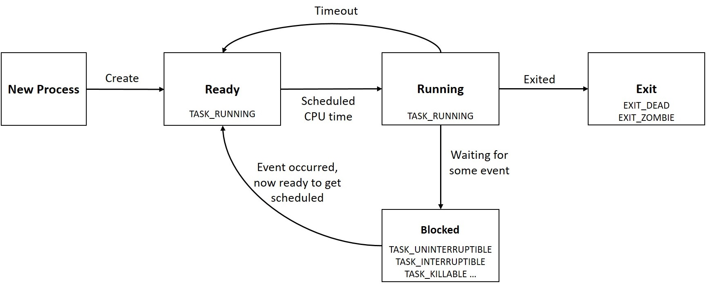
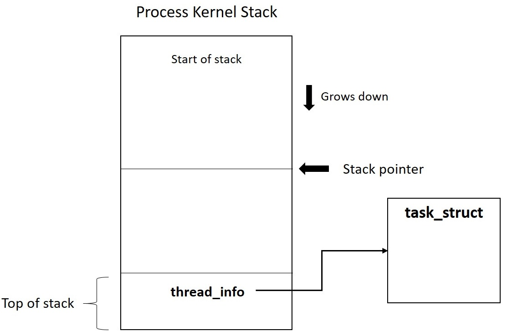

## linux process

---------------------

- In linux, a process descriptor is an instance of type `struct task_struct`.

- process states:

  - **TASK_RUNNING** (0): The task is either executing or contending for CPU in the scheduler run-queue.

  - **TASK_INTERRUPTIBLE** (1): The task is in an interruptible wait state; it remains in wait  until an awaited condition becomes true, such as the availability of  mutual exclusion locks, device ready for I/O, lapse of sleep time, or an exclusive wake-up call. While in this wait state, any signals generated for the process are delivered, causing it to wake up before the wait  condition is met.

  - **TASK_KILLABLE**: This is similar to **TASK_INTERRUPTIBLE**, with the exception that interruptions can only occur on fatal signals, which makes it a better alternative to **TASK_INTERRUPTIBLE**.

  - **TASK_UNINTERRUTPIBLE** (2): The task is in uninterruptible wait state similar to **TASK_INTERRUPTIBLE**, except that generated signals to the sleeping process do not cause  wake-up. When the event occurs for which it is waiting, the process  transitions to **TASK_RUNNING**. This process state is rarely used.

  - **TASK_ STOPPED** (4): The task has received a STOP signal. It will be back to running on receiving the continue signal (SIGCONT).

  - **TASK_TRACED** (8): A process is said to be in traced state when it is being combed, probably by a debugger.

  - **EXIT_ZOMBIE** (32): The process is terminated, but its resources are not yet reclaimed.

  - **EXIT_DEAD** (16): The child is terminated and all the resources held by it freed,  after the parent collects the exit status of the child using *wait*.

    
  
 - `pid`: the default maximum number pid is 32768, specified through the `/proc/sys/kernel/pid_max` interface.

 - `tgid`: thread group id. When a process spawns a new thread, the child gets a unique `pid`, but inherits the `tgid` from its parent.

 - kernel stack: The kernel stack is directly mapped to the physical memory, mandating  the arrangement to be physically in a contiguous region. The kernel stack by default is 8kb for x86-32.

   Initially, the address of the current `task structure` is loaded into a processor register; for register-restricted architectures, the `task structure` of the current process is directly made available at the top of the kernel stack that it owns.

   Then, with the growth of `task structure`  size, a new structure `thread_info` is put on the top of the kernel stack, which contains a pointer to the corresponding `task structure`.

   

- kernel stack overflow: With the 4.9 release, the kernel has come with a new system to set up virtually mapped kernel stacks. `vmalloc`