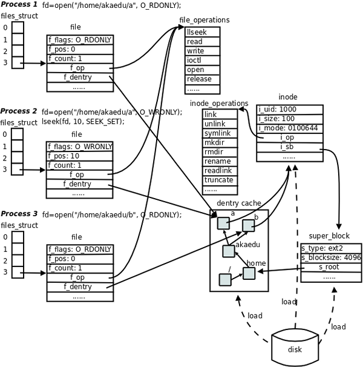

# **linux-vfs note**

---

#### 主要的结构体
> 1. File
>
>    File structures represent open files, that is, an inode together with a current (reading/writing) offset. The offset can be easily set by the system call lseek(). Note that instead of a pointer to the inode we have a pointer to the dentry.
> ```c
> struct file (
> 	struct dentry *f_dentry;	//文件名必须已知
>     mode_t f_mode;	//文件的访问模式
>     unsigned int f_flags;	//打开文件时指定的标志
>     loff_t f_pos;	//文件的当前位移量（文件指针）
>     atomic_t f_count;	//文件对象的使用计数
>     ...
>     struct file_operations *fp;
> )
> ```
> 2. dentry
>
>    The dentries encode the filesystem tree structure, the name of the files. Thus, the main parts of a dentry are the inodes (if any) that belongs to it, the name (the final part of the pathname), and the parent (the name of the containing directory).
> ```c
> struct dentry {
>     struct inode*d_inode;	//相关联的索引节点
>     struct dentry *d_parent;	//父目录的目录项对象
>     struct qstr d_name;		//目录项名称
>     struct list_head d_subdirs;		//子目录链表
>     ...
>     struct dentry_operations *d_op;
> }
> ```
> 3. inode
>
>    An (in-core) inode contains the metadata of a file: its serial number, its protection (mode), its owner, its size, the dates of last access, creation and last modification, etc.
> ```c
> struct inode {
>     struct list_head i_sb_list;		//超级块链表
>     uid_t i_uid;	//使用者id
>     gid_t i_gid;	//使用组id
>     unsigned long i_ino;	//节点号
>     loff_t i_size;	//以字节为单位的文件大小
>     struct timespec i_atime;	//最后访问时间
>     struct timespec i_mtime;	//最后修改时间
>     struct timespec i_ctime;	//最后改变时间
>     umode_t i_mode;		//访问权限
>     atomic_t i_count;		//引用计数
>     union {
>         struct pipe_inode_info *i_pipe;		//管道信息
>         struct block_device *i_bdev;		//块设备驱动
>         struct cdev *i_cdev;	//字符设备驱动；
>     };
>     ...
>     struct inode_operations *i_op;
> }
> ```
> 4. super_block
>
>    The superblock gives global information on a filesystem: the device on which it lives, its block size, its type, the dentry of the root of the filesystem.
>
> ```c
> struct super_block {
>         dev_t s_dev;	//设备标识符
>         unsigned long s_blocksize;	//以字节为单位的块大小
>         struct file_system_type *s_type;
>         struct super_operations *s_op;
>         struct dentry *s_root;	//目录挂载点
>         ...
> }
> ```
>
> 

#### 进程与文件的联系

>```c
>struct task_struct {
>	struct files_struct *files;
>	...
>}
>struct files_struct {
>	struct file *fd_array[NR_OPEN_DEFAULT]; //默认64 (BITS_PER_LONG)
>    struct fdtable *fdt;	//指向其他fd表的指针
>    struct embedded_fd_set close_on_exec_init;	//exec()时关闭的文件描述符链表
>	...
>}
>struct fdtable {
>    unsigned int max_fds;
>    struct file ** fd;
>    fd_set *close_on_exec;	//file description flag
>    ...
>}
>```

>
>
>

#### 系统调用与以上结构体的联系

>```c
>	   #include <sys/types.h>
>       #include <sys/stat.h>
>       #include <fcntl.h>
>
>       int open(const char *pathname, int flags);
>       int open(const char *pathname, int flags, mode_t mode);
>```
>
>> A call to open creates a file struct, an entry in the system-wide table of open files, 
>>
>> the return value is an index in the files struct's fd array.

>```c
> 		#include <unistd.h>
>
>       int dup(int oldfd);
>```
>
>>both the old fd ad new fd refers to the same struct file, so the struct file's f_count is changed.
>>
>>Besides, the fork() call can also increment a struct file's f_count; Note, both the two fd share the same file status flag, but they do not share the file description flag.

> ```c
> #include <unistd.h>
> 
> int link(const char* oldpath, const char * newpath);
> ```
>
> >link creates a new hard link  to an existing file, so it creates a new struct dentry, and the struct inode's i_count is modified.

> ```c
> #include <unistd.h>
> 
> int unlink(const char* pathname);
> ```
>
> > unlink deletes a name from the file system. If that name is the last link to a file and no process have the file open, the file is deleted. That id, a dentry struct id deleted, and the struct inode's i_count id decremented. If the i_count equals 0, the inode is deleted.

> ```c
> #include <unistd.h>
> 
> int close(int fd);
> ```
>
> > close()  closes  a  file descriptor, so that it no longer refers to any file and may be reused. so a struct file's f_count id decremented.
> >
> > If fd is the last file descriptor referring to the underlying open file
> >  description  (struct file), the resources associated with the open file
> >  description are freed (struct file is deleted); if the file descriptor was the last reference to a file which has been removed using unlink, the file is deleted.

> ```c
> 		#include <unistd.h>
>        #include <fcntl.h>
> 
>        int fcntl(int fd, int cmd, ... /* arg */ );
> 
> ```
>
> >  F_GETFD (void)
> >
> > F_SETFD (int)
> >
> > If the FD_CLOEXEC bit is set, the file descriptor will automatically be closed during a successful  execve(2).
> >
> > F_GETFL (void)
> >
> >  F_SETFL (int)
> >
> >  File access mode (O_RDONLY, O_WRONLY, O_RDWR) and file creation flags (i.e., O_CREAT, O_EXCL, O_NOCTTY, O_TRUNC) in arg  are  ignored.
> > On  Linux,  this  command can change only the O_APPEND, O_ASYNC, O_DIRECT, O_NOATIME, and O_NONBLOCK flags.

[参考链接](https://www.win.tue.nl/%7Eaeb/linux/lk/lk-8.html)

