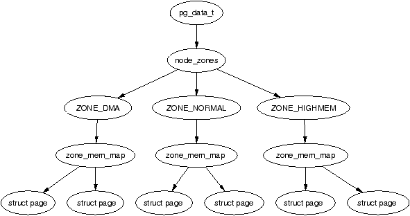
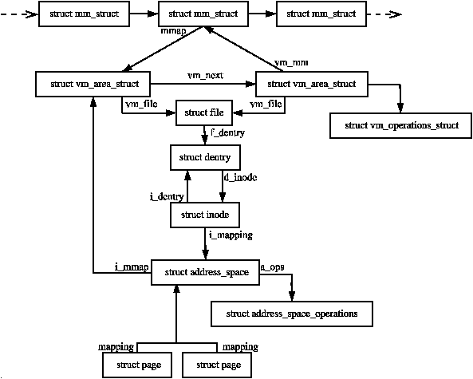
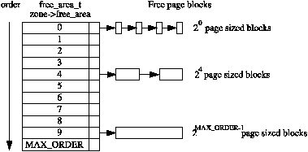

## linux-vm

----------------------------

- ## describe physical memory

   - `NUMA`:	non-uniform memory access

  - node: ` typedef struct pglist_data pg_data_t`

  - zone: `typedef struct zone_struct zone_t`

  - page:  Each physical page frame is represented by a `struct page` and all the structs are kept in a global `mem_map` array which is usually stored at the beginning of `ZONE_NORMAL` or just after the area reserved for the loaded kernel image in low memory machines.

  - relation between node, zone and page:
        
	-  zone watermarks: pages_low, pages_min, pages_high (`kswapd` is waken up if available memory is low)

- ## page table management

   - Each process has a pointer (`mm_struct`→`pgd`) to its own *Page Global Directory (`PGD`)* which is a physical page frame. The linear address is as follow:

     

   - `PTE`： `pte_t` is simply a 32 bit integer within a struct. Each `pte_t` points to an address of a page frame and all the addresses  are guaranteed to be page aligned. Therefore, there are `PAGE_SHIFT` (12) bits in that 32 bit value that are free for status bits of the page table entry.

- ## process address space

  - PAGE_OFFSET: user/kernel split, 0xC0000000 on x86

  - Two parts:	user space (0-PAGE_OFFSET), kernel space (PAGE_OFFSET-4GB)

  - User space potentially changes with each full context switch.

  - Kernel space remains constant.

  - Relationship between address space related structures:

    ​	

  - `mm_struct`: one for each precess, one for all the threads in a process.

  - address space related system call:

    | system call | description                                                  |
    | :---------: | ------------------------------------------------------------ |
    |   fork()    | Creates a new process with a new address space. All the 	pages are marked COW and are shared between the two processes 	until a page fault occurs to make private copies |
    |   clone()   | clone()` allows a new process to be created that 	shares parts of its context with its parent and is how 	threading is implemented in Linux. `clone()` without 	the `CLONE_VM` set will create a new address 	space which is essentially the same as `fork() |
    |   mmap()    | `mmap()` creates a new region within the process 	linear address space |
    |  mremap()   | Remaps or resizes a region of memory. If the virtual 	 address space is not available for the mapping, the region 	 may be moved unless the move is forbidden by the caller. |
    |  munmap()   | This destroys part or all of a region. If the region been 	unmapped is in the middle of an existing region, the existing 	region is split into two separate regions |
    |   shmat()   | This attaches a shared memory segment to a process address 	space |
    |   shmdt()   | Removes a shared memory segment from an address space        |
    |  execve()   | This loads a new executable file replacing the current 	address space |
    |   exit()    | Destroys an address space and all regions                    |
    
  - `vm_area_struct`:a full list of mapped regions a process has can be viewed via /proc/PID/maps

  - page fault: 

    ​      major: data has to be read from disk, task_struct->maj_flt
    
    ​	  minor: other page fault, task_struct->min_flt 
  
- ## boor memory allocator

- ## physical page allocation

   - Binary Buddy Allocator

     - the allocator maintains blocks of free pages where each block is a power of two number of pages.

     - The exponent for the power of two sized block is referred to as the *order*.

     - Each zone has a `free_area_t` struct array called `free_area[MAX_ORDER]`.

     - 示意图

       
     
   - fragmentation
   
     ​	`external`: inability to service a request because the available memory only exists in small blocks.
   
     ​	`internal`: wasted space where a large block has to be assigned to service a small request.   
   
- ## non-continuous memory allocation

- ## slab allocator

  - 3 principle aims:
    - The allocation of small blocks of memory to help eliminate internal fragmentation that would be otherwise caused by the buddy system;
    - The caching of commonly used objects so that the system does not waste time allocating, initializing and destroying objects.
    - The better utilization of hardware cache by aligning objects to the L1 or L2 caches.
  - `kmalloc`:
    - Linux keeps two sets of caches for small memory allocations for which the physical page allocator is unsuitable. One set is for use with DMA and the other is suitable for normal use.
    - With the existence of the sizes cache, the slab allocator is able to offer a new allocator function, `kmalloc()` for use when small memory buffers are required. When a request is received, the appropriate sizes cache is selected and an object assigned from it.

- ## high memory management

   - `PKMap`: persistent kernel map address space

- ## page frame reclamation

- ## swap management

   - private or anonymous pages used by a process, unlike those backed by a file on disk, cannot be simply discarded to be read in later. Instead they have to be carefully copied to *backing storage*, sometimes called the *swap area*. 

- ## shared memory virtual filesystem

   - `tmpfs`

- ## out of memory management

  
  
  [参考链接](https://www.kernel.org/doc/gorman)
  
  

